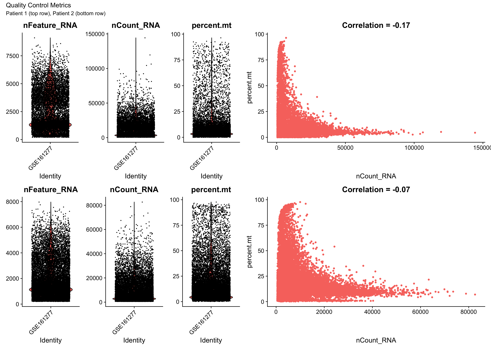
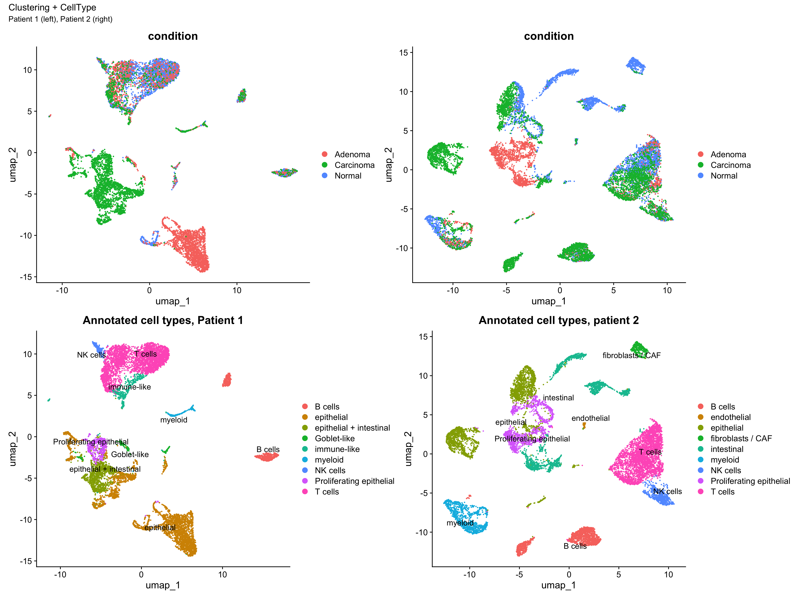
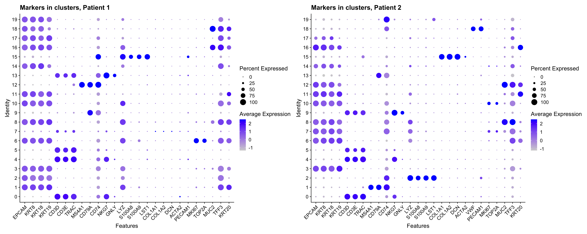
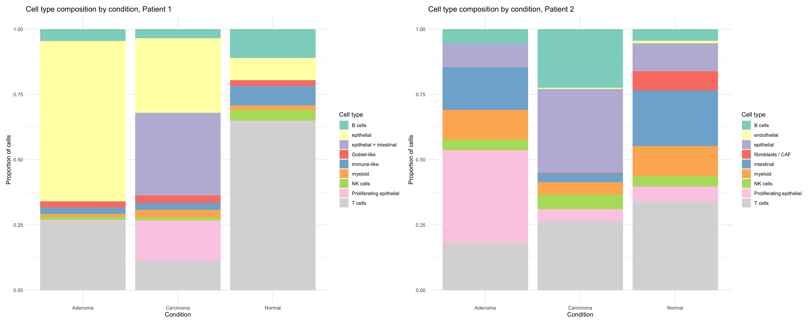
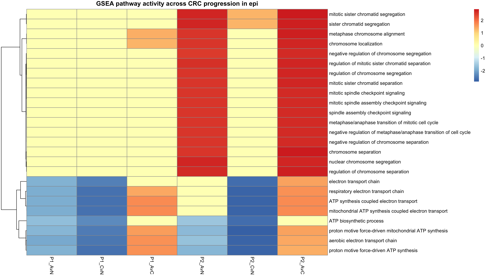

# Single cell transcriptomics of colorectal cancer progression GSE161277

## Project overview

This project explores cellular and transcriptional changes during colorectal cancer (CRC) progression using single-cell RNA sequencing (scRNA-seq) data.

The analysis focuses on two independent patients and compares three disease stages:

* Normal tissue
* Adenoma
* Carcinoma

The goal was to identify:

* major cell populations present in the tumor microenvironment,
* changes in cell-type composition during disease progression,
* differentially expressed genes,
* biological pathways associated with tumor progression,
* reproducible pathway signatures shared between patients.

---

## Dataset

Publicly available scRNA-seq dataset:

**GSE161277**

The dataset contains single-cell transcriptomic profiles from colorectal tissue samples representing different stages of CRC development.

---

## Analysis workflow

### 1. Quality control

Cells were evaluated using standard scRNA-seq quality metrics:

* number of detected genes (`nFeature_RNA`)
* total UMI counts (`nCount_RNA`)
* percentage of mitochondrial transcripts

Quality-control metrics were inspected separately for each patient.

### 2. Data normalization and feature selection

For each patient:

* normalization was performed using Seurat
* highly variable genes were identified
* dimensionality reduction was performed using PCA

### 3. Clustering and cell-type annotation

Cells were clustered using the Seurat workflow:

* PCA
* nearest-neighbor graph construction
* clustering
* UMAP visualization

Cell types were manually annotated based on canonical marker genes.

Identified populations included:

* epithelial cells
* intestinal epithelial cells
* proliferating epithelial cells
* T cells
* NK cells
* B cells
* myeloid/monocyte populations
* fibroblasts/CAF
* endothelial cells

### 4. Cell-type composition analysis

The relative abundance of cell populations was compared between normal tissue, adenoma and carcinoma for each patient separately.

### 5. Differential expression analysis

Differential expression was performed within selected cell populations using Seurat's `FindMarkers()` function.

Comparisons:

* Adenoma vs Normal
* Carcinoma vs Normal
* Adenoma vs Carcinoma

### 6. Functional enrichment analysis

Functional interpretation was performed using:

* Gene Ontology (GO)
* KEGG pathway enrichment
* Gene Set Enrichment Analysis (GSEA)

for epithelial and T-cell populations.

### 7. Cross-patient pathway reproducibility

To identify biologically consistent signals, enriched pathways were compared across patients.

Shared pathway signatures were visualized using pathway activity heatmaps.

---

## Key results

### Quality control
Quality-control metrics indicated good-quality cells across both patients after filtering.

### Cell-type annotation
UMAP visualization and canonical marker genes enabled identification of major epithelial, immune, stromal, and endothelial populations.

Marker expression patterns used for manual annotation:

### Changes in cell-type composition
Cell-type proportions were compared across normal tissue, adenoma, and carcinoma samples for each patient.

### Epithelial compartment

Epithelial populations showed strong enrichment of pathways associated with:

* cell cycle progression,
* chromosome segregation,
* mitotic spindle organization,
* DNA replication.

These signatures became increasingly prominent during progression from normal tissue to carcinoma.

In addition, metabolic pathways related to:

* oxidative phosphorylation,
* ATP synthesis,
* respiratory electron transport

were consistently detected across patients.

### T-cell compartment

T-cell populations displayed enrichment of pathways related to:

* immune activation,
* cytokine signaling,
* antimicrobial and humoral immune responses,
* IL-17 signaling,
* NF-kappa B signaling.

However, T-cell pathway signatures showed greater inter-patient variability than epithelial cells.

### Reproducibility across patients

Cross-patient analysis revealed that epithelial-cell programs were more reproducible between patients than immune-cell programs, suggesting stronger conservation of tumor-intrinsic transcriptional changes during CRC progression.

Epithelial cells

T cells

---

## Software

Analysis performed in R using:

* Seurat
* clusterProfiler
* org.Hs.eg.db
* enrichplot
* ggplot2
* patchwork
* pheatmap
* dplyr

Session information is available in the project files.

---

Author:
Dominika Brosch
